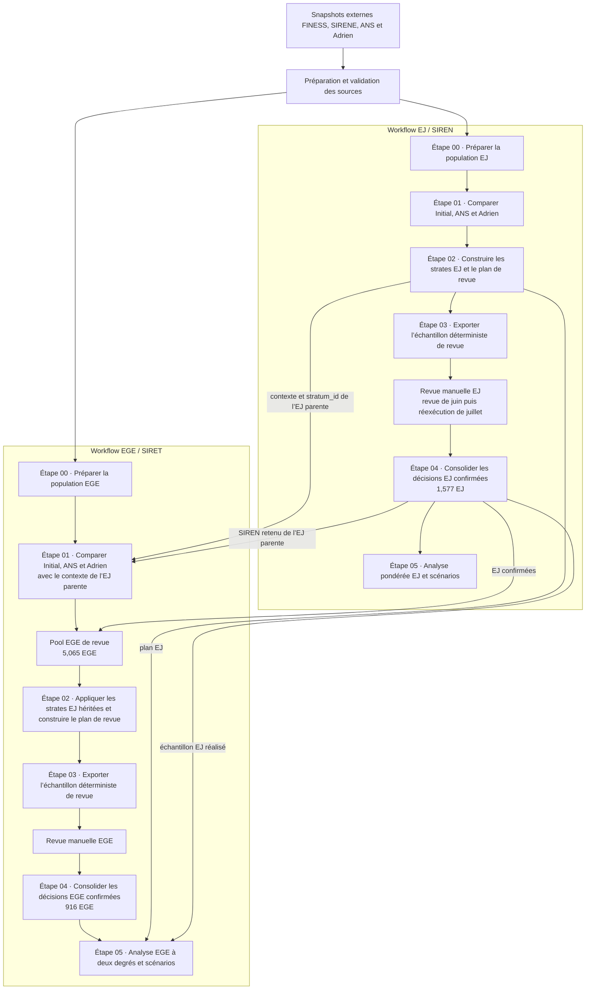

# Vue d’ensemble du projet et historique de l’étude

## Objectif et domaine

FINESS identifie les organisations françaises sanitaires et médico-sociales à deux
niveaux imbriqués : une **entité juridique (EJ)** peut contenir plusieurs
**établissements géographiques (EGE)**. SIRENE présente une hiérarchie comparable :
une **unité légale**, identifiée par un **SIREN**, peut contenir plusieurs
**établissements**, chacun identifié par un **SIRET**. Le projet évalue et cherche à
améliorer la qualité de l’appariement des entités juridiques FINESS avec des
identifiants SIREN et des établissements géographiques FINESS avec des identifiants
SIRET — un processus appelé ici *sirénisation*.

Le workflow ne suppose pas qu’une source automatisée fournisse toujours une réponse
correcte. Il compare l’identifiant déjà enregistré dans FINESS (**Initial**) avec des
propositions provenant d’**ANS** et d’**Adrien**, répartit les entités en strates
selon les caractéristiques de ces sources, envoie des échantillons déterministes en
revue manuelle et utilise les cas examinés pour estimer la performance de règles
déployables.

## Dépendance entre EJ et EGE

Une EJ est une entité juridique FINESS et fait l’objet d’une revue par rapport à des
SIREN candidats. Un EGE est un établissement géographique appartenant à une EJ et
fait l’objet d’une revue par rapport à des SIRET candidats. La revue des EJ doit se
terminer en premier : l’ensemble complet des décisions EJ confirmées constitue à la
fois l’échantillon d’analyse EJ et l’échantillon de premier degré pour l’analyse EGE.

Le pool EGE de revue ne contient que les EGE dont l’EJ parente appartient à cet
ensemble. Il constitue le cadre de sondage du second degré.

L’étude au 26/08/2026 comprend :

| Quantité | Valeur actuelle |
|---|---:|
| EJ FINESS après filtrage de la population EJ–EGE | 48,742 |
| Décisions EJ confirmées / EJ de premier degré pour EGE | 1,577 |
| EGE du pool de revue appartenant à ces EJ | 5,065 |
| Décisions EGE confirmées | 916 |
| Strates EJ et EGE représentées dans les plans | 157 chacune |
| Totaux de référence initiaux EJ / EGE | 632 / 633 |

## Vue d’ensemble du workflow

## Chronologie des sources et de l’étude

### FINESS, SIRENE, ANS et Adrien

* **FINESS** fournit les populations EJ/EGE et les identifiants. L’étude utilise le
  snapshot FINESS daté du **4 mai 2026**. Les extractions FINESS sont diffusées sur
  data.gouv.fr :

  * entités juridiques : [https://www.data.gouv.fr/datasets/finess-extraction-des-entites-juridiques](https://www.data.gouv.fr/datasets/finess-extraction-des-entites-juridiques) ;
  * établissements : [https://www.data.gouv.fr/datasets/finess-extraction-du-fichier-des-etablissements](https://www.data.gouv.fr/datasets/finess-extraction-du-fichier-des-etablissements).

* **SIRENE** fournit les attributs des unités légales et des établissements utilisés
  pour enrichir les propositions d’appariement et faciliter leur revue. La base SIRENE
  est diffusée sur data.gouv.fr :
  [https://www.data.gouv.fr/datasets/base-sirene-des-entreprises-et-de-leurs-etablissements-siren-siret](https://www.data.gouv.fr/datasets/base-sirene-des-entreprises-et-de-leurs-etablissements-siren-siret). Le snapshot SIRENE
  principal est daté du **1 juin 2026**. Pour les EGE, le statut administratif des
  établissements est volontairement actualisé à l’aide du snapshot des établissements
  SIRENE du **1 juillet 2026**. Les fichiers de stock SIRENE des périodes antérieures
  au mois courant ne sont pas conservés dans l’offre de téléchargement courante ; cela
  n’empêche toutefois pas de reproduire les résultats de l’étude à partir des
  propositions et décisions conservées, SIRENE étant utilisé ici principalement pour
  enrichir les informations présentées lors de la revue.

* **Approche ANS** — appelée **ANS** dans ce projet — est une approche de *fuzzy
  matching* développée à l’ANS par Tahir Sabre Abdoulaye et Meryeme Chiboub, avec des
  pipelines EJ/SIREN et EGE/SIRET organisés en trois phases progressives. Chaque
  pipeline commence par valider l’identifiant déjà enregistré dans FINESS à partir de
  similarités de dénomination et d’adresse, puis recherche des candidats alternatifs
  en élargissant progressivement le périmètre géographique et les critères de
  comparaison. Le pipeline EGE s’appuie en partie sur les SIREN issus du pipeline EJ,
  et une étape finale vérifie la cohérence entre le SIREN de l’EJ parente et le SIRET
  de l’EGE. La vague ANS EJ de juin 2026 a servi à la première revue. À la suite des
  constats issus de la première analyse des résultats ANS de juin, l’équipe ANS a
  mis en œuvre des règles d’appariement supplémentaires et actualisé ses bases sources
  FINESS et SIRENE. La vague de juillet 2026 qui en a résulté a été utilisée pour la
  réexécution EJ, tandis que les EGE utilisent la vague de juillet. Voir
  `docs/ANS_documentation_SN_ST_finess.pdf` pour la méthodologie détaillée.

* **Approche Adrien** — appelée **Adrien** dans ce projet — est une approche de
  génération multi-sources de candidats et de validation lexicale développée par
  Adrien Tortel et mise en œuvre principalement au au niveau EGE/SIRET. Elle évalue
  d’abord le SIRET déjà enregistré dans FINESS à partir de la dénomination et de
  l’adresse, puis génère des candidats alternatifs à partir de plusieurs branches,
  notamment l’extension au sein d’un même SIREN, les liens de succession, les
  propositions externes et les référentiels internes. Les candidats ainsi générés sont
  à leur tour évalués lexicalement ; leur provenance est conservée et un même candidat
  peut être étayé par plusieurs sources. La chaîne ne sélectionne pas automatiquement
  un identifiant final unique. Les propositions EJ/SIREN sont ensuite dérivées des
  candidats EGE/SIRET en reliant chaque SIRET proposé à son SIREN et en agrégeant les
  éléments de preuve au niveau de l’EJ. Les candidats de juin 2026 maintenus sont
  utilisés ; les extensions expérimentales de juillet ne sont pas des inputs
  opérationnels. Voir `docs/ADRIEN_METHOD.md` pour plus de détails.

Dans le cadre de ce projet, le fichier de référence des acronymes d’Adrien a été étendu.
Des acronymes fréquents ont été identifiés dans les dénominations FINESS et leurs formes
développées ont été complétées avec l’apport métier avant comparaison et intégration à
la référence Adrien existante. Le fichier d’acronymes obtenu a été intégré au projet
Adrien ; les éléments de travail exploratoires sont conservés sous
`project_tools/extension_chaine_adrien/`.

Les classifications des catégories hospitalières et SCM/SEL s’appuient sur les
éléments de nomenclature SAE 2021 ; les codes EHPAD 500–502 constituent séparément
des connaissances projet fournies par un collègue et conservées.

Le dépôt évalue les propositions ANS et Adrien ; il ne reproduit pas l’intégralité de
chaque système d’appariement en amont. Le PDF ANS de portée limitée et la description
de provenance figurant dans ce document fournissent du contexte, mais ne constituent
pas le code du workflow opérationnel.

### Deux vagues de revue EJ

La première revue EJ a utilisé les éléments ANS de juin. La réexécution de juillet a
utilisé le même ordre aléatoire historique, prérempli les décisions antérieures
disponibles et examiné des cas supplémentaires. Les décisions actuelles de juillet
prévalent dans les trois conflits de recouvrement enregistrés.

L’ensemble des décisions réalisées en juillet comprend des extensions ordonnées au-delà
des cibles de référence et des cas historiques/hors préfixe étiquetés conservés dans
l’étude terminée. Leur traitement et les limites associées du plan d’échantillonnage
sont documentés dans `docs/METHODOLOGY.md`.

## Résultats de l'étude au 26/08/2026

Les principaux livrables correspondant à cette version de l’étude sont conservés
sous `study_snapshots/2026_08_26/`. Ce snapshot figé constitue la référence des
résultats présentés dans cette section ; `results/` reste le répertoire des outputs
courants régénérables.

### Décalages de périmètre entre les sources

La comparaison met également en évidence des entités présentes dans les sources de
propositions mais absentes du périmètre FINESS utilisé pour l’étude :

| Source | EJ absentes du périmètre FINESS | EGE absents du périmètre FINESS |
|---|---:|---:|
| ANS | 181 | 1 568 |
| Adrien | 2 | 2 |

Pour l’ANS, ces écarts s’expliquent principalement par un décalage de synchronisation
des référentiels : la vague ANS utilisée dans l’étude a été produite à partir d’une base
FINESS plus récente que le snapshot FINESS du 4 mai 2026 retenu comme population de
référence du projet. Des EJ et EGE apparus ou modifiés entre ces versions peuvent donc
être présents dans les données ANS sans exister dans le snapshot FINESS analysé.

Les écarts observés pour Adrien sont négligeables en volume. Ils proviennent de
certaines sources externes de propositions utilisées comme inputs de sa méthode, dans
lesquelles quelques références peuvent être désynchronisées par rapport au FINESS de
l’étude ou comporter ponctuellement une erreur de saisie.

Dans les deux cas, ces entités ne sont pas ajoutées à la population d’étude : la table
de cohérence reste construite sur le périmètre FINESS de référence et les propositions
correspondantes sont donc exclues de l’analyse.

### Performances des méthodes de proposition

Les principales estimations ponctuelles calées sont :

| Indicateur sur la population à rapprocher | EJ | EGE |
|---|---:|---:|
| Taux de résultats corrects d’Initial | 90.64% | 66.03% |
| Couverture ANS | 97.06% | 87.62% |
| Taux de propositions correctes ANS | 92.07% | 85.40% |
| Taux de résultats corrects de la règle « ANS sinon Initial » | 91.63% | 80.32% |
| Couverture Adrien | 77.67% | 70.44% |
| Taux de propositions correctes Adrien | 98.21% | 92.45% |
| Taux de résultats corrects de la règle « Adrien sinon Initial » | 93.39% | 80.38% |
| Taux de résultats corrects de la règle « Adrien une proposition sinon Initial » | 93.43% | 77.77% |

Ces résultats peuvent être visualisés avec
`project_tools/review_performance_summary/`, qui compare pour les EJ et les EGE la
part estimée de résultats corrects, incorrects et non couverts des différentes règles.

Les décisions confirmées issues de la revue peuvent également être exportées avec leurs
poids via `project_tools/review_sample_benchmark/` afin de constituer des échantillons
annotés de référence partageables et d’évaluer la couverture et la justesse d’une autre
base d’appariement EJ–SIREN ou EGE–SIRET sur les mêmes annotations.

Les autres indicateurs globaux sont :

| Indicateur | EJ | EGE |
|---|---:|---:|
| Identifiant Initial manquant | 2.84% | 11.73% |
| Incertitude de revue | 3.04% | 21.50% |
| Entités estimées à fermer | 1.32% | 3.24% |
| SIREN/SIRET identifié parmi les entités à rapprocher | 99.81% | 97.50% |
| Ni ANS ni Adrien correct | 6.54% | 14.72% |

Au seuil d’acceptation des strates de 95%, le meilleur scénario combiné observé
atteint un taux global estimé de résultats corrects de 95.39% pour les EJ (+4.75
points de pourcentage par rapport à Initial) et de 79.25% pour les EGE (+13.22
points). Ces scénarios sont des aides descriptives à la décision : puisque la
meilleure règle est sélectionnée et évaluée sur les mêmes données de revue, leur
performance peut être optimiste.

Il s’agit d’estimations pondérées selon le plan et, pour le reporting global, calées —
non de proportions brutes issues de la revue. Les classeurs présentent également les
résultats par strate et l’ensemble des scénarios de strates acceptées. Voir
`docs/METHODOLOGY.md` pour les dénominateurs, la pondération et l’interprétation.

### Scoring exploratoire des SIRET ANS

Un modèle de régression logistique pondérée a été développé sur les 687 EGE examinés à
rapprocher disposant d’une proposition ANS afin d’estimer la probabilité que le SIRET
proposé soit correct. L’évaluation out-of-fold donne une AUC pondérée de **0.910** et
un score de Brier de **0.061**. Avec un seuil de score de **0.90**,
**82.0% des EGE disposant d’une proposition ANS** sont acceptés, soit
**71.9% de l’ensemble des EGE à rapprocher** ; **98.4%** des propositions ainsi
acceptées sont correctes.

Si Initial est conservé pour les EGE sans proposition ANS et pour ceux dont le score
est inférieur au seuil, la règle « ANS si score ≥ 0.90, sinon Initial » atteint un taux
estimé de résultats corrects de **82.4%**, contre **80.3%** pour « ANS sinon Initial »
sans sélection par le score et **66.0%** pour Initial seul.

Ces résultats utilisent toutefois, pour mesurer la cohérence du SIREN, le SIREN EJ
corrigé lors de la revue. Une prochaine étape consiste à
**réexécuter le scoring avec le SIREN obtenu à l’issue de la sirénisation EJ**, afin
d’évaluer le modèle dans des conditions plus proches de son utilisation opérationnelle.

## Limites et travaux futurs

- Les EJ historiques/hors préfixe conservées signifient que l’échantillon réalisé de
  premier degré n’est pas un pur préfixe aléatoire de juillet. Les résultats
  reproduisent l’étude terminée mais ne doivent pas être décrits comme parfaitement
  conformes au plan théorique.
- Les décisions EGE incluent les revues incertaines afin d’éviter une exclusion fondée
  sur le résultat. Les estimations obtenues constituent des premiers enseignements
  utiles, mais pas nécessairement des estimations finales définitives ; une nouvelle
  revue ciblée est une piste future d’amélioration de la qualité.
- Les intervalles de Wilson sont des approximations descriptives par strate. Aucun
  intervalle de confiance global n’est revendiqué.
- Les scénarios qui sélectionnent la meilleure règle observée dans chaque strate
  utilisent les mêmes données pour la sélection et l’évaluation et peuvent donc être
  optimistes.
- Le scoring exploratoire des propositions SIRET ANS utilise actuellement le SIREN EJ
  corrigé lors de la revue pour construire l’un de ses principaux prédicteurs. Avant tout
  usage opérationnel, il devra être réévalué avec le SIREN issu de la sirénisation EJ,
  afin de mesurer les performances dans des conditions proches de la production.
- Les résultats peuvent évoluer à mesure que changent les méthodes de proposition,
  les données sources ou l’implémentation du projet. Les futures vagues d’étude
  devront documenter les versions et snapshots utilisés afin de permettre
  l’interprétation et la comparaison entre vagues.
- Une étape naturelle suivante consiste à utiliser les cas examinés et les modes
  d’échec observés pour améliorer les méthodes de proposition ANS et Adrien actuelles,
  puis à évaluer les méthodes révisées sur une nouvelle vague d’étude.
- Certaines sources utilisées par la méthode Adrien, notamment la base de
  Claire Lelarge et le référentiel interne, sont figées et ne sont plus maintenues.
  Leur vieillissement peut donc affecter les propositions produites sur des versions
  plus récentes de FINESS et de SIRENE.
- Une extension future pourrait évaluer et intégrer les méthodes d’appariement fondées
  sur les LLM développées par Jean-Claude Arbaut en tant que source de propositions
  supplémentaire.
- Une nouvelle version de FINESS a été déployée le 20 juillet 2026, avec des
  spécifications potentiellement différentes. Les futures utilisations du projet
  devront vérifier la nouvelle structure FINESS et mettre à jour la logique de
  prétraitement si nécessaire avant d’exécuter une nouvelle vague d’étude.
